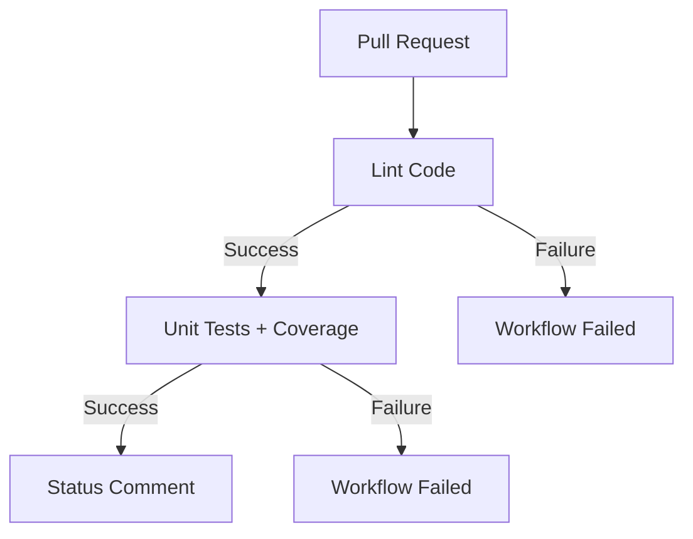

# GitHub Actions Workflows

## Pull Request CI (`pull-request.yml`)

Workflow automatycznie uruchamiany przy każdym Pull Requestcie do gałęzi `master`, `main` lub `develop`.

### Przepływ działania



### Jobs

#### 1. Lint Code 🔍

- **Cel**: Walidacja jakości kodu za pomocą ESLint
- **Uruchamia**: `npm run lint`
- **Czas wykonania**: ~1-2 minuty
- **Wymagania**: brak

#### 2. Unit Tests 🧪

- **Cel**: Uruchomienie testów jednostkowych z pomiarem pokrycia kodu
- **Uruchamia**: `npm run test:unit:coverage`
- **Czas wykonania**: ~2-5 minut
- **Wymagania**: Job `lint` musi zakończyć się sukcesem
- **Artifacts**: 
  - Raport coverage zapisywany do artifacts (30 dni retention)
  - Upload do Codecov (jeśli skonfigurowane)

#### 3. Status Comment 💬

- **Cel**: Dodanie komentarza do PR z podsumowaniem wyników
- **Czas wykonania**: ~10-30 sekund
- **Wymagania**: Oba joby `lint` i `unit-test` muszą zakończyć się sukcesem
- **Uprawnienia**: Wymaga `pull-requests: write`
- **Treść komentarza**:
  - Status każdego joba
  - Procent pokrycia testami
  - Czas zakończenia workflow

### Konfiguracja

#### Wymagane secrets

Opcjonalne (dla integracji z Codecov):
- `CODECOV_TOKEN` - token do uploadu raportów coverage na Codecov.io

#### Permissions

Workflow automatycznie otrzymuje `GITHUB_TOKEN` z uprawnieniami do:
- Odczytu kodu (`contents: read`)
- Pisania komentarzy do PR (`pull-requests: write`)

### Przykładowy komentarz w PR

```markdown
## ✅ Pull Request CI - Wszystkie testy przeszły pomyślnie!

### 📊 Podsumowanie

| Job | Status |
|-----|--------|
| 🔍 Lint | ✅ Passed |
| 🧪 Unit Tests | ✅ Passed |
| 📈 Coverage | 85.3% |

### 📝 Szczegóły

- **Linting**: Kod przeszedł pomyślnie przez ESLint
- **Unit Tests**: Wszystkie testy jednostkowe zakończone sukcesem
- **Coverage**: Raport pokrycia testów został wygenerowany i zapisany

---
*Workflow completed at 2026-02-01T13:45:23.123Z*
```

### Troubleshooting

#### Workflow nie uruchamia się

- Sprawdź czy PR jest skierowany do właściwej gałęzi (`master`, `main`, `develop`)
- Zweryfikuj czy workflow file jest na branch'u bazowym (target branch)

#### Lint failuje

- Uruchom lokalnie: `npm run lint`
- Napraw błędy: `npm run lint:fix`
- Commit i push zmian

#### Unit tests failują

- Uruchom lokalnie: `npm run test:unit`
- Sprawdź logi testów w Actions
- Napraw testy i commit zmian

#### Status comment się nie pojawia

- Sprawdź czy oba joby `lint` i `unit-test` zakończyły się sukcesem
- Zweryfikuj uprawnienia workflow w ustawieniach repo: Settings → Actions → General → Workflow permissions
- Upewnij się że "Allow GitHub Actions to create and approve pull requests" jest włączone

#### Coverage nie jest wyświetlane

- Sprawdź czy `vitest.config.ts` ma poprawną konfigurację coverage
- Zweryfikuj czy `@vitest/coverage-v8` jest zainstalowane
- Sprawdź czy `coverage/coverage-summary.json` jest generowany

### Dostosowywanie workflow

#### Zmiana wersji Node.js

```yaml
- name: Setup Node.js
  uses: actions/setup-node@v4
  with:
    node-version: '22'  # zmień na wymaganą wersję
    cache: 'npm'
```

#### Dodanie testów E2E

```yaml
e2e-test:
  name: E2E Tests
  runs-on: ubuntu-latest
  needs: unit-test
  
  steps:
    - name: Checkout code
      uses: actions/checkout@v4
    
    - name: Setup Node.js
      uses: actions/setup-node@v4
      with:
        node-version: '20'
        cache: 'npm'
    
    - name: Install dependencies
      run: npm ci
    
    - name: Install Playwright browsers
      run: npx playwright install --with-deps
    
    - name: Run E2E tests
      run: npm run test:e2e
```

#### Zmiana retention artifacts

```yaml
- name: Archive coverage artifacts
  uses: actions/upload-artifact@v4
  if: always()
  with:
    name: coverage-report
    path: coverage/
    retention-days: 7  # zmień na wymaganą liczbę dni
```

### Best Practices

1. **Zawsze testuj workflow lokalnie** przed pushem używając `act` (https://github.com/nektos/act)
2. **Monitoruj czas wykonania** - optymalizuj długo działające joby
3. **Używaj cache** - dla zależności npm używamy cache w `setup-node`
4. **Paralelizuj** - joby które mogą działać równolegle powinny mieć osobne definicje
5. **Fail fast** - używaj `needs` aby zatrzymać pipeline gdy lint failuje

### Linki

- [GitHub Actions Documentation](https://docs.github.com/en/actions)
- [Vitest Coverage](https://vitest.dev/guide/coverage.html)
- [Codecov Action](https://github.com/codecov/codecov-action)
